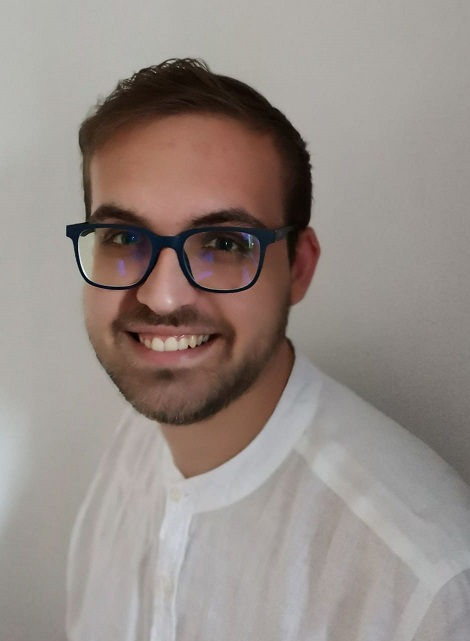

# Francesco Catania

## __About me__
Hallo, I am Francesco Catania. I’m 22 years old and I live in Florence, Italy.
Currently I attend the Game Programming Course at TheSign Academy in Florence,  which I will end this year. 

I am a reliable, motivated and honest worker with good comunication skills and a great passion for video-games, which is the main reason why I decided to start this journey into Game Development.

My favorite branch of programming is Gameplay Programming, followed by Tools and UI.

## __Academy Projects__
 |[Treasure Hunters](https://drive.google.com/file/d/1GbkLQ7R8dJdG-pEGe4M1SnDQR-x6Q1Bd/view?usp=sharing)|

## __Game Jams__
- |[AdventureGameJam 2020, A Strange Alchemy Adventure](https://gamejolt.com/games/a_strange_alchemy_adventure/493453) | [Project](https://gitlab.com/FocaccinaMan/adventurejam2020)|
- |[GlobalGameJam 2019 Pisa, Stick It Togheter](https://globalgamejam.org/2019/games/stick-it-together)|
- |[GlobalGameJam 2020 Pisa, Neura-l-Ink](https://globalgamejam.org/2020/games/neura-l-ink-9?token=1595080965) | [Download build](https://drive.google.com/file/d/1zcU7UA1eCsdPrAIsj_kH9Tsf2s7lPQHg/view?usp=sharing)|
- |[GameProgrammingJam 2019, Escape Room](https://drive.google.com/file/d/1cbFKBWfCmqoHR7nT6m-rQAHIbRKyIWXs/view?usp=sharing)|
- |[GameProgrammingJam 2020, Kamikaser](https://drive.google.com/file/d/1GHfLjFXZqk473L3Hb05zQDk2mDmgN10r/view?usp=sharing)|

## __Personal Info__
- Date of Birth: 10 January 1998
- e-mail: catania.francesco.dev[at]outlook.it
- [LinkedIn](https://www.linkedin.com/in/francescocataniadev/)
- [GitLab](https://gitlab.com/FocaccinaMan)
- [GitHub](https://github.com/FrancescoCataniaDev)
